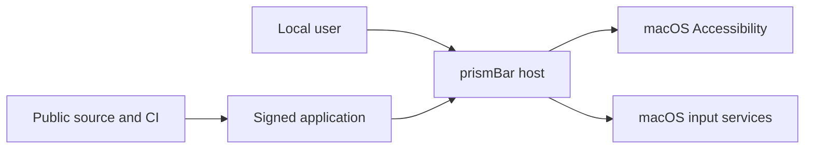

# prismBar threat model

## Executive summary

prismBar is a single-user, local-only macOS 27 utility with one intentionally powerful authority: Accessibility access to observe and move menu bar items. The highest-risk areas are the signed host boundary, stale menu bar geometry, synthesized input, and release provenance. The shipping target limits these risks with live permission checks, exact host signing requirements, bounded parsing and execution, fresh topology verification, one core executable, no embedded XPC service, no network stack, public-safety release audits, and source-matched verification. No critical or high residual threat was identified in the current source. A current-source Developer ID archive, notarization, final shipping-artifact reconciliation, and physical Accessibility testing remain release gates.

## Scope and assumptions

In scope:

- Runtime host code in `App/` and `Sources/prismBarAccessibility`, `Sources/prismBarCore`, and `Sources/prismBarEngine`.
- The preserved, non-shipping plugin host contract in `Sources/prismPluginKit`, calculator code in `Sources/prismCalcPlugin`, and XPC service source in `XPC/`, solely to prevent an unsafe future reintroduction.
- Entitlements, privacy declarations, project configuration, CI, release audits, tests, and source licensing.

Out of scope:

- The frozen GPL reference repository, which remains isolated and uninspected by this clean-room implementation.
- The separately distributed prismCalc application beyond its bundle identifier and explicit launch action.
- Compromise of macOS, the user account, root access, Apple signing infrastructure, or the local hardware.

Validated operating assumptions:

- prismBar is a local, single-user utility distributed as a Developer ID application for macOS 27 on Apple silicon.
- It exposes no network service, remote API, dynamic plugin loader, telemetry path, updater, or content upload. An explicit About action may ask the default browser to open the fixed public source URL.
- No plugin is linked, embedded, launched, or exposed by the core release. User-installed and downloaded plugins are not accepted.
- Source is intended to remain public under MPL-2.0 and must match distributed covered binaries.
- Menu item labels are user-sensitive local data and must remain memory-only.

Open questions that can change risk ranking:

- None for the current architecture. Adding downloaded plugins, networking, an updater, cloud sync, or multi-user state requires a new threat model.

Current reconciliation evidence:

- On 2026-08-27, the current working-tree candidate passed 147 package tests in Debug, Release, AddressSanitizer, and ThreadSanitizer configurations; strict SwiftLint; Xcode static analysis; warnings-as-errors Debug and unsigned Release builds; the release-bundle audit; licensing, public-safety, Git-history secret, and native-glass source audits; and 18 native UI tests across all shipping destinations and accessibility appearance variants.
- The signed Development build installed at `/Applications/prismBar.app` moved a disposable synthetic status item from the first to the last Prism Rail position in one verified action across two intervening targets. The physical status-item coordinate changed from x=1061 to x=1151, the authoritative post-move Rail snapshot placed it last, and the same app restored x=1061 before the fixture was removed. No real menu labels were captured, printed, or persisted.
- This working-tree evidence is not release evidence. Clean-revision stress, a revision-bound assurance report, Developer ID archive, notarization, shipping-flow install, and the remaining physical matrix are still required.
- Source revision `7db7a98b0e4827437b5a5d885ac25b3cad899da9` passed the complete unsigned production verifier on 2026-08-26. The gate covered pinned tools, MPL and SBOM integrity, public-safety and Git-history scanning, workflow linting, generated-project reproducibility, strict SwiftLint, 128 tests in Debug and Release, AddressSanitizer, ThreadSanitizer, Xcode Debug build, static analysis, Xcode Release build, and the final unsigned bundle allowlists.
- Source revision `5dc0be646aff441153efeab19ed19b48eafc31f1` passed five complete host, permission, plugin, appearance, and synthetic movement lifecycle cycles over 1,081 seconds on 2026-08-26. The run completed 640 package tests and 70 UI tests with no failures. It did not exercise physical signed-app movement.
- Historical Developer ID archives proved the preserved reciprocal-signing implementation before Card integration was frozen. Those archives are not the core release artifact and do not justify embedding a service now.
- Revision-bound core-only candidate evidence, dual app and disk-image notarization, stapling, public-source binding, and the physical permission matrix remain release gates until their exact artifacts pass.

## System model

### Primary components

- **SwiftUI host:** Presents the status item, prismDeck command center, settings, and recovery surfaces. `App/prismBarApp.swift`, `App/AppLifecycle.swift`.
- **Permission and topology engine:** Validates the canonical install and signing identity, checks live Accessibility trust, discovers menu bar elements, resolves physical display surfaces, and verifies movements. `Sources/prismBarEngine/SystemPermissionClients.swift`, `Sources/prismBarAccessibility/MenuBarTopologyDiscovery.swift`, `Sources/prismBarAccessibility/DisplaySurfaceResolver.swift`.
- **Native input performer:** Produces one bounded Command-drag on a validated display surface and guarantees mouse-up, Command-up, and pointer restoration. `Sources/prismBarAccessibility/NativeMenuBarMovePerformer.swift`.
- **Dormant Card sources:** Preserve bounded protocol, renderer, calculator, and reciprocal-signing work for future review, but are excluded from the application target and release bundle. `Sources/prismPluginKit`, `Sources/prismCalcPlugin`, `XPC/prismCalcPluginService`.
- **Build and release gates:** Pin tools, reject dependencies and sensitive artifacts, scan Git history, analyze code, run sanitizers from temporary directories outside the package root, and require a one-executable/no-XPC core Release bundle. `scripts/ci-verify.sh`, `scripts/audit-public-safety.sh`, `scripts/audit-release-bundle.sh`.

### Data flows and trust boundaries

- **User to host:** Button, menu, keyboard, and status-item actions cross the UI boundary as typed commands. Native SwiftUI controls constrain the command set. No arbitrary command text enters the movement engine.
- **Host to macOS Accessibility:** The host reads menu bar roles, descriptions, titles, frames, and enabled state through AX APIs. Live `AXIsProcessTrusted` checks, per-application messaging timeouts, depth limits, scalar limits, and a 2,048-observation aggregate limit bound this boundary.
- **Host to macOS input:** A verified move plan becomes one Command key-down, one dense mouse-drag path, one mouse-up, one Command key-up, and pointer restoration through Core Graphics. Fresh source order, same-display geometry, visible reserved menu bar space, a shared hard deadline, mandatory cleanup, and post-action observation constrain the side effect.
- **Dormant Card boundary:** No XPC or plugin data flow exists in the shipping application. Preserved protocol and reciprocal-signing controls must be reassessed before the target may embed a Card service.
- **About to default browser:** An explicit View Source command may open only the compile-time `https://github.com/plac9/prismBar` repository, optionally scoped to the embedded 40-character source revision. No user or plugin input contributes to the URL.
- **Developer source to distributed application:** Xcode 27 produces an arm64 Developer ID application. CI audits tools, history, licenses, entitlements, linked libraries, executables, privacy declarations, and credential-shaped strings. Signing, notarization, and source-to-binary revision proof remain mandatory release steps.

#### Diagram

## Assets and security objectives

| Asset | Why it matters | Security objective |
|---|---|---|
| Accessibility authority | Can observe and move local menu bar items | C, I, A |
| Menu item labels and topology | Reveal installed applications and user workflow | C, I |
| Pointer and mouse-button state | Incorrect cleanup can disrupt user input | I, A |
| Host signing identity | Establishes which code may exercise privileged paths | I |
| User preferences | Control non-authoritative local presentation and request history | I, A |
| Public source and release artifact | Must preserve licensing, provenance, and binary integrity | I, A |
| Developer signing credentials | Compromise permits malicious trusted builds | C, I |

## Attacker model

### Capabilities

- A local unprivileged process may expose malformed or rapidly changing Accessibility trees.
- A malicious or compromised build input may attempt to add dependencies, executables, entitlements, secrets, personal data, or private linked libraries.
- A user may trigger repeated actions, close windows, revoke permission, or change displays or spaces during an operation.

### Non-capabilities

- There is no remote request surface, listener, updater, downloaded plugin, account, shared tenant, or server-side data store.
- An attacker cannot supply arbitrary files, URLs, scripts, executable paths, environment values, or plugin bundles through the product UI.
- Root, administrator, kernel, Apple certificate authority, and physical-device compromise are out of scope.

## Entry points and attack surfaces

| Surface | How reached | Trust boundary | Notes | Evidence |
|---|---|---|---|---|
| SwiftUI commands | Local user interaction | User to host | Fixed typed actions only | `App/Features/MenuBar/MenuBarView.swift`, `App/Features/Overview/PrismDeckView.swift` |
| Accessibility observations | Running local applications | App process to host | 256 apps, depth 4, 256 elements per app, 2,048 observations total, bounded strings, 250 ms AX timeout | `Sources/prismBarAccessibility/NativeMenuBarObservationReader.swift` / `NativeMenuBarObservationReader` |
| Synthetic movement | Verified move plan | Host to WindowServer input | Same display, visible menu bar, one drag, cleanup and fresh verification | `Sources/prismBarAccessibility/NativeMenuBarMovePerformer.swift` / `NativeMenuBarMovePerformer` |
| Dormant Card source | Developer change | Source to future target | Must remain excluded from the core target and requires a new security/privacy review before reintroduction | `project.yml`, `Tests/ReleaseWorkflowTests/core_shipping_contract.sh` |
| Public source action | Explicit View Source command | Host to default browser | One compile-time HTTPS repository URL and validated 40-character revision | `App/Features/About/AboutView.swift`, `Sources/prismBarCore/ProductIdentity.swift` |
| Local preferences | App lifecycle and plugin toggle | User profile to host | Request history is not treated as permission truth | `App/AppModel.swift`, `Sources/prismBarEngine/AccessibilityPermission.swift` |
| Source and build inputs | Developer or CI changes | Repository to artifact | No external Swift packages, pinned tools, secret and bundle audits | `scripts/ci-verify.sh`, `scripts/audit-licensing.sh`, `scripts/audit-public-safety.sh` |

## Top abuse paths

1. A malicious local app exposes an oversized or cyclic Accessibility tree. prismBar bounds application count, traversal depth, element count, and AX call duration, then treats the source as unavailable.
2. The menu bar changes after the user chooses a destination. prismBar rejects stale source order before input, performs at most one bounded Command-drag, and verifies the observed order after the move.
3. Permission is revoked during discovery or movement. Live checks convert the app to a denied state, invalidate topology, and stop further actions.
4. A build change introduces a credential, personal path, extra executable, plugin service, dependency, entitlement, or non-Apple library. CI fails before producing a releasable artifact.

## Threat model table

| Threat ID | Threat source | Prerequisites | Threat action | Impact | Impacted assets | Existing controls | Gaps | Recommended mitigations | Detection ideas | Likelihood | Impact severity | Priority |
|---|---|---|---|---|---|---|---|---|---|---|---|---|
| TM-001 | Compromised signed host | Attacker replaces or compromises the trusted host after Accessibility approval | Misuse Accessibility to observe or rearrange items outside user intent | Workflow disclosure or menu bar integrity loss | Accessibility authority, labels, topology | Exact host identity check and canonical install gate in `SystemPermissionClients.swift`; no background movement loop | Signing and notarization proof are pending | Finish Developer ID archive, notarization, staple, Gatekeeper, and signed-upgrade tests | Surface live permission and action state without logging labels | Low | High | Medium |
| TM-002 | Future developer change | Card source is reintroduced into the application target | Embed a plugin service without repeating security and privacy review | Unreviewed process and protocol boundary | Signing identity, Accessibility isolation | Core shipping contract rejects plugin framework links and XPC embedding; release bundle audit rejects extra executables | Dormant code can drift while excluded | Require a new ADR, threat model, privacy contract, entitlement audit, reciprocal-signing proof, and physical tests before reintroduction | CI failure on target or bundle expansion | Low | High | Medium |
| TM-003 | Malformed or hostile future Card payload | Card integration has been explicitly re-enabled | Send oversized, malformed, recursive, or capability-expanding data | Host or service denial of service, unsafe rendering | Future Card availability and panel integrity | Preserved 64 KiB wire cap, typed schema, bounded collections, URL rejection, service sandbox, and timeout tests | Controls are not active shipping controls while the target is excluded | Revalidate hostile corpus and sanitizers on the exact future shipping target | Test-only rejection and timeout counters | Low | Medium | Low |
| TM-004 | Rapid topology change or deceptive local app | Accessibility access is granted and menu items change during action | Cause prismBar to drag the wrong item or across a display | Menu bar integrity loss or disrupted pointer or modifier state | Topology, pointer state, modifier state | Fresh exact source-order check, stable per-session IDs, same-surface geometry, reserved-space validation, one drag, mandatory mouse-up, Command-up, pointer restoration, hard deadline, and post-move verification | Physical multi-display and full-screen matrix remains pending | Complete signed physical matrix and retain bounded coordinator timeout | User-visible sanitized outcome, never observed labels | Medium | Medium | Medium |
| TM-005 | Accidental diagnostics or future developer change | Sensitive labels or local paths are added to logging or artifacts | Persist or publish observed menu data or personal environment data | Privacy breach | Labels, topology, developer environment | No production logger, no network, memory-only models, full-history and bundle string audits | Future diagnostics could reintroduce leakage | Keep logs label-free and extend allowlists whenever a logging framework is introduced | CI public-safety and release-bundle audits | Low | Medium | Low |
| TM-006 | Compromised future Card | Card integration has been explicitly re-enabled | Request an unsafe host-side mutation | Local integrity and workflow disruption | Future Card mutation surface | No Card mutation surface ships; preserved design uses explicit commands and allowlists | Must be re-audited if Cards return | Keep generic URLs, paths, executables, AX commands, and inventory out of the protocol | Exact future target and bundle audits | Low | Medium | Low |
| TM-007 | Build or release supply-chain actor | Developer or CI input is modified | Ship code not represented by the reviewed public revision or add hidden authority | Broad integrity compromise and license breach | Artifact, source provenance, signing credentials | No external packages, SPDX SBOM, pinned tools, secret scan, exact executable and entitlement allowlists, signed commits | Public revision-to-binary proof, archive, notarization, and publication are pending | Generate revision manifest with source commit and artifact hashes, sign and notarize only clean committed source, publish matching tag before distribution | Release evidence report with checksums, signature chain, notarization ticket, and source revision | Medium | High | Medium |
| TM-008 | Local user-profile modification | Attacker can write the app preference domain | Change non-authoritative presentation or request history | Confusing UI state | Preferences, availability | Live AX trust is authoritative and stored state never grants permission | Preference tampering is not separately reported | Keep security decisions out of `UserDefaults`; reset malformed preferences to defaults | UI reflects current live permission state | Medium | Low | Low |

## Criticality calibration

- **Critical:** Remote or zero-interaction code execution, signing-key theft, or a sandbox escape that grants Accessibility authority. No current entry point supports these examples.
- **High:** A reproducible signature bypass, unreviewed executable embedding, or silent collection and export of menu labels. Exact host signing, one-executable bundle enforcement, and lack of networking reduce these to residual review targets.
- **Medium:** Incorrect menu movement across a stale topology, local denial of service that persists across relaunch, or distribution of a binary that does not match public source. These affect local integrity or release trust without remote reach.
- **Low:** Preference tampering that cannot grant authority or a sanitized operation failure. These are visible, local, and bounded.

## Focus paths for security review

| Path | Why it matters | Related Threat IDs |
|---|---|---|
| `Sources/prismBarEngine/SystemPermissionClients.swift` | Defines the host signing identity and authoritative Accessibility trust check | TM-001, TM-007, TM-008 |
| `Sources/prismBarAccessibility/NativeMenuBarObservationReader.swift` | Processes data exposed by every running GUI application | TM-004, TM-005 |
| `Sources/prismBarAccessibility/DisplaySurfaceResolver.swift` | Maps observed geometry to bounded physical display surfaces without persisting display identities | TM-004, TM-005 |
| `Sources/prismBarAccessibility/NativeMenuBarMovePerformer.swift` | Converts verified plans into privileged synthetic input | TM-001, TM-004 |
| `Sources/prismBarEngine/VerifiedMoveCoordinator.swift` | Enforces freshness, deadlines, execution, and post-action verification | TM-004 |
| `App/AppModel+MenuBarActions.swift` | Orchestrates permission revocation, section state, batch moves, and user-facing failures | TM-001, TM-004, TM-005 |
| `project.yml` | Must keep the dormant Card and XPC sources outside the core application target | TM-002, TM-003, TM-006, TM-007 |
| `Config/prismBar.entitlements` | Must remain empty despite host Accessibility authority | TM-001, TM-007 |
| `scripts/audit-release-bundle.sh` | Enforces executable, library, identifier, privacy, string, and entitlement allowlists | TM-005, TM-007 |
| `scripts/audit-public-safety.sh` | Rejects sensitive artifacts, personal data, unsafe links, and unapproved remotes | TM-005, TM-007 |
| `.github/workflows/ci.yml` | Defines the external build and verification environment | TM-007 |

Quality check:

- All shipping user, Accessibility, input, preference, and build entry points are represented; dormant XPC and mutation sources are classified as non-shipping future risk.
- Every runtime and release trust boundary is covered by at least one threat.
- Runtime controls, CI and development controls, and tests are separated explicitly.
- Deployment, exposure, data sensitivity, plugin model, and public-source assumptions reflect the owner's stated direction.
- Physical macOS 27 proof and release provenance remain explicit gates, not assumed controls.
