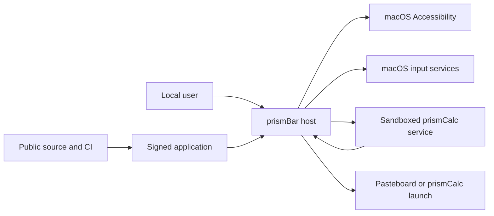

# prismBar threat model

## Executive summary

prismBar is a single-user, local-only macOS 27 utility with one intentionally powerful authority: Accessibility access to observe and move menu bar items. The highest-risk areas are the signed host boundary, the reciprocal XPC signing boundary, stale menu bar geometry, and release provenance. The code currently limits these risks with live permission checks, exact signing requirements, bounded parsing and execution, fresh topology verification, a sandboxed plugin service, no network stack, and public-safety release audits. No critical or high residual threat was identified in the current source. Developer ID signing, notarization, final shipping-artifact reconciliation, and physical Accessibility testing remain release gates.

## Scope and assumptions

In scope:

- Runtime host code in `App/` and `Sources/prismBarAccessibility`, `Sources/prismBarCore`, and `Sources/prismBarEngine`.
- The bundled plugin host contract in `Sources/prismPluginKit`, the first-party calculator in `Sources/prismCalcPlugin`, and the XPC service in `XPC/`.
- Entitlements, privacy declarations, project configuration, CI, release audits, tests, and source licensing.

Out of scope:

- The frozen GPL reference repository, which remains isolated and uninspected by this clean-room implementation.
- The separately distributed prismCalc application beyond its bundle identifier and explicit launch action.
- Compromise of macOS, the user account, root access, Apple signing infrastructure, or the local hardware.

Validated operating assumptions:

- prismBar is a local, single-user utility distributed as a Developer ID application for macOS 27 on Apple silicon.
- It exposes no network service, remote API, dynamic plugin loader, telemetry path, updater, or content upload.
- Only bundled, same-team plugins are allowed. User-installed and downloaded plugins are not accepted.
- Source is intended to remain public under MPL-2.0 and must match distributed covered binaries.
- Menu item labels are user-sensitive local data and must remain memory-only.

Open questions that can change risk ranking:

- None for the current architecture. Adding downloaded plugins, networking, an updater, cloud sync, or multi-user state requires a new threat model.

## System model

### Primary components

- **SwiftUI host:** Presents the status item, command center, settings, plugin panels, and recovery surfaces. `App/prismBarApp.swift`, `App/AppLifecycle.swift`.
- **Permission and topology engine:** Validates the canonical install and signing identity, checks live Accessibility trust, discovers menu bar elements, and verifies movements. `Sources/prismBarEngine/SystemPermissionClients.swift`, `Sources/prismBarAccessibility/MenuBarTopologyDiscovery.swift`.
- **Native input performer:** Produces one bounded Command-drag on a validated display surface and restores mouse state. `Sources/prismBarAccessibility/NativeMenuBarMovePerformer.swift`.
- **Plugin host:** Opens a named XPC service, enforces the plugin signing requirement, validates its manifest and declarative response, and applies an allowlisted local mutation. Any external app launch also requires the exact target identifier and LaClair Technologies team signature. `App/PluginClient.swift`, `Sources/prismPluginKit/BundledPluginPolicy.swift`, `Sources/prismBarEngine/SystemPermissionClients.swift`.
- **prismCalc XPC service:** Accepts only the signed host, decodes bounded JSON messages, maintains in-memory calculator state, and runs inside the App Sandbox without file or network entitlements. `XPC/prismCalcPluginService/ServiceMain.swift`, `Config/prismCalcPluginService.entitlements`.
- **Build and release gates:** Pin tools, reject dependencies and sensitive artifacts, scan Git history, analyze code, run sanitizers, and audit the unsigned Release bundle. `scripts/ci-verify.sh`, `scripts/audit-public-safety.sh`, `scripts/audit-release-bundle.sh`.

### Data flows and trust boundaries

- **User to host:** Button, menu, keyboard, and status-item actions cross the UI boundary as typed commands. Native SwiftUI controls constrain the command set. No arbitrary command text enters the movement engine.
- **Host to macOS Accessibility:** The host reads menu bar roles, descriptions, titles, frames, and enabled state through AX APIs. Live `AXIsProcessTrusted` checks, per-application messaging timeouts, depth limits, scalar limits, and a 2,048-observation aggregate limit bound this boundary.
- **Host to macOS input:** A verified move plan becomes one Command-drag through Core Graphics. Fresh source order, same-display geometry, visible reserved menu bar space, cancellation cleanup, and post-action observation constrain the side effect.
- **Host to plugin service:** A maximum 64 KiB JSON request crosses named XPC. The host requires the exact plugin bundle identifier and team; the service requires the exact host identifier and team. Protocol, version, capability, identifier, label, URL, collection, and mutation allowlists validate replies.
- **Plugin response to local side effect:** A validated response may copy a bounded result to the pasteboard or open only an allowlisted, same-team prismCalc application. Both require an explicit user command.
- **Developer source to distributed application:** Xcode 27 produces an arm64 Developer ID application. CI audits tools, history, licenses, entitlements, linked libraries, executables, privacy declarations, and credential-shaped strings. Signing, notarization, and source-to-binary revision proof remain mandatory release steps.

#### Diagram

## Assets and security objectives

| Asset | Why it matters | Security objective |
|---|---|---|
| Accessibility authority | Can observe and move local menu bar items | C, I, A |
| Menu item labels and topology | Reveal installed applications and user workflow | C, I |
| Pointer and mouse-button state | Incorrect cleanup can disrupt user input | I, A |
| Host and XPC signing identity | Establishes which code may exercise privileged paths | I |
| Plugin panel and mutations | Can influence rendered controls, pasteboard, and app launch | I, A |
| User preferences | Control request history and plugin enablement | I, A |
| Public source and release artifact | Must preserve licensing, provenance, and binary integrity | I, A |
| Developer signing credentials | Compromise permits malicious trusted builds | C, I |

## Attacker model

### Capabilities

- A local unprivileged process may expose malformed or rapidly changing Accessibility trees.
- A local process may attempt to connect to the bundled XPC service or impersonate a host or plugin with the wrong signature.
- A malicious or compromised build input may attempt to add dependencies, executables, entitlements, secrets, personal data, or private linked libraries.
- A user may trigger repeated actions, close windows, revoke permission, change displays or spaces, or terminate the plugin during an operation.

### Non-capabilities

- There is no remote request surface, listener, updater, downloaded plugin, account, shared tenant, or server-side data store.
- An attacker cannot supply arbitrary files, URLs, scripts, executable paths, environment values, or plugin bundles through the product UI.
- Root, administrator, kernel, Apple certificate authority, and physical-device compromise are out of scope.

## Entry points and attack surfaces

| Surface | How reached | Trust boundary | Notes | Evidence |
|---|---|---|---|---|
| SwiftUI commands | Local user interaction | User to host | Fixed typed actions only | `App/Features/MenuBar/MenuBarView.swift`, `App/Features/Overview/StatusMenuView.swift` |
| Accessibility observations | Running local applications | App process to host | 256 apps, depth 4, 256 elements per app, 2,048 observations total, bounded strings, 250 ms AX timeout | `Sources/prismBarAccessibility/NativeMenuBarObservationReader.swift` / `NativeMenuBarObservationReader` |
| Synthetic movement | Verified move plan | Host to WindowServer input | Same display, visible menu bar, one drag, cleanup and fresh verification | `Sources/prismBarAccessibility/NativeMenuBarMovePerformer.swift` / `NativeMenuBarMovePerformer` |
| XPC request decoder | Signed host process | Host to sandbox service | 64 KiB maximum, typed JSON, session handshake | `Sources/prismPluginKit/PluginWire.swift`, `Sources/prismCalcPlugin/PrismCalcPluginSession.swift` |
| XPC response renderer | Signed bundled service | Service to host | Schema and capability validation before native rendering | `Sources/prismPluginKit/PluginPanel.swift`, `Sources/prismPluginKit/BundledPluginPolicy.swift` |
| Pasteboard mutation | Explicit Copy command | Host to shared pasteboard | Bounded calculator result only | `App/AppModel.swift` / `applyPluginMutations` |
| App launch mutation | Explicit Open prismCalc command | Host to Launch Services | Exact allowlisted bundle identifier and exact LaClair Technologies team signature | `App/AppModel.swift` / `applyPluginMutations`, `Sources/prismBarEngine/SystemPermissionClients.swift` / `SignedApplicationCode` |
| Local preferences | App lifecycle and plugin toggle | User profile to host | Request history is not treated as permission truth | `App/AppModel.swift`, `Sources/prismBarEngine/AccessibilityPermission.swift` |
| Source and build inputs | Developer or CI changes | Repository to artifact | No external Swift packages, pinned tools, secret and bundle audits | `scripts/ci-verify.sh`, `scripts/audit-licensing.sh`, `scripts/audit-public-safety.sh` |

## Top abuse paths

1. A malicious local app exposes an oversized or cyclic Accessibility tree. prismBar bounds application count, traversal depth, element count, and AX call duration, then treats the source as unavailable.
2. The menu bar changes after the user chooses a destination. prismBar rejects stale source order before input and verifies the observed order after one move.
3. A wrong-team process tries to impersonate prismCalc. The host rejects the XPC peer through its exact code-signing requirement before accepting responses.
4. A wrong-team process tries to command the plugin service. The service applies the reciprocal host requirement and accepts only the typed protocol after handshake.
5. A compromised plugin response tries to render a URL, huge value, duplicate control, excessive collection, or arbitrary app launch. The host rejects the entire response before rendering or applying mutations, and verifies the team signature before opening the one allowlisted application.
6. A plugin hangs or crashes during a request. The two-second deadline, connection invalidation, failure budget, stale callback gate, and manual retry keep the host responsive.
7. Permission is revoked during discovery or movement. Live checks convert the app to a denied state, invalidate topology, and stop further actions.
8. A build change introduces a credential, personal path, extra executable, dependency, entitlement, or non-Apple library. CI fails before producing a releasable artifact.

## Threat model table

| Threat ID | Threat source | Prerequisites | Threat action | Impact | Impacted assets | Existing controls | Gaps | Recommended mitigations | Detection ideas | Likelihood | Impact severity | Priority |
|---|---|---|---|---|---|---|---|---|---|---|---|---|
| TM-001 | Compromised signed host | Attacker replaces or compromises the trusted host after Accessibility approval | Misuse Accessibility to observe or rearrange items outside user intent | Workflow disclosure or menu bar integrity loss | Accessibility authority, labels, topology | Exact host identity check and canonical install gate in `SystemPermissionClients.swift`; no background movement loop | Signing and notarization proof are pending | Finish Developer ID archive, notarization, staple, Gatekeeper, and signed-upgrade tests | Surface live permission and action state without logging labels | Low | High | Medium |
| TM-002 | Local impersonating process | Attacker can start a process but lacks the project team certificate | Impersonate the host or bundled plugin over XPC | Untrusted commands or panel responses | Signing identity, plugin mutations | Reciprocal exact bundle and team requirements in `App/PluginClient.swift` and `XPC/prismCalcPluginService/ServiceMain.swift` | Live wrong-signature rejection is not yet recorded | Add a separately signed negative fixture and record both rejection directions | Count sanitized trust rejection outcomes only in test evidence | Low | High | Medium |
| TM-003 | Malformed or hostile XPC payload | A valid peer is compromised or has a bug | Send oversized, malformed, recursive, or capability-expanding data | Host or service denial of service, unsafe rendering | Plugin availability, panel integrity | 64 KiB wire cap, typed Codable schema, bounded collections, URL rejection, allowlisted mutations, service sandbox, two-second timeout | Codable nesting depth depends on Foundation implementation | Keep hostile corpus and sanitizer gates; add lifecycle soak under repeated service restarts | Test-only counters for timeout, decode rejection, and failure-budget transitions | Low | Medium | Low |
| TM-004 | Rapid topology change or deceptive local app | Accessibility access is granted and menu items change during action | Cause prismBar to drag the wrong item or across a display | Menu bar integrity loss or disrupted pointer state | Topology, pointer state | Fresh exact source-order check, stable per-session IDs, same-surface geometry, reserved-space validation, one drag, mouse-up and pointer restoration, post-move verification | Physical multi-display and full-screen matrix remains pending | Complete signed physical matrix and retain bounded coordinator timeout | User-visible sanitized outcome, never observed labels | Medium | Medium | Medium |
| TM-005 | Accidental diagnostics or future developer change | Sensitive labels or local paths are added to logging or artifacts | Persist or publish observed menu data or personal environment data | Privacy breach | Labels, topology, developer environment | No production logger, no network, memory-only models, full-history and bundle string audits | Future diagnostics could reintroduce leakage | Keep logs label-free and extend allowlists whenever a logging framework is introduced | CI public-safety and release-bundle audits | Low | Medium | Low |
| TM-006 | Compromised valid plugin | Same-team bundled plugin is malicious or defective | Request clipboard overwrite or application launch | Local integrity and workflow disruption | Pasteboard, launch behavior | Explicit user commands, bounded text, exact application allowlist, exact target-team signature validation, host-side mutation application | Clipboard replacement is inherently global | Preserve explicit gesture requirement and never add arbitrary URL, path, or executable mutations | UI confirmation text after copy or failed launch | Low | Medium | Low |
| TM-007 | Build or release supply-chain actor | Developer or CI input is modified | Ship code not represented by the reviewed public revision or add hidden authority | Broad integrity compromise and license breach | Artifact, source provenance, signing credentials | No external packages, SPDX SBOM, pinned tools, secret scan, exact executable and entitlement allowlists, signed commits | Public revision-to-binary proof, archive, notarization, and publication are pending | Generate revision manifest with source commit and artifact hashes, sign and notarize only clean committed source, publish matching tag before distribution | Release evidence report with checksums, signature chain, notarization ticket, and source revision | Medium | High | Medium |
| TM-008 | Local user-profile modification | Attacker can write the app preference domain | Change request history or plugin enablement | Confusing UI or plugin availability change | Preferences, availability | Live AX trust is authoritative; stored request history never grants permission; plugin service still requires signatures | Preference tampering is not separately reported | Keep security decisions out of `UserDefaults`; reset malformed preferences to defaults | UI reflects current live permission and plugin state | Medium | Low | Low |

## Criticality calibration

- **Critical:** Remote or zero-interaction code execution, signing-key theft, or a sandbox escape that grants Accessibility authority. No current entry point supports these examples.
- **High:** A reproducible signature bypass, arbitrary code or application launch from plugin data, or silent collection and export of menu labels. Existing exact signing, mutation allowlists, and lack of networking reduce these to residual review targets.
- **Medium:** Incorrect menu movement across a stale topology, local denial of service that persists across relaunch, or distribution of a binary that does not match public source. These affect local integrity or release trust without remote reach.
- **Low:** A recoverable plugin interruption, preference tampering that cannot grant authority, or a sanitized operation failure. These are visible, local, and bounded.

## Focus paths for security review

| Path | Why it matters | Related Threat IDs |
|---|---|---|
| `Sources/prismBarEngine/SystemPermissionClients.swift` | Defines the host signing identity and authoritative Accessibility trust check | TM-001, TM-007, TM-008 |
| `Sources/prismBarAccessibility/NativeMenuBarObservationReader.swift` | Processes data exposed by every running GUI application | TM-004, TM-005 |
| `Sources/prismBarAccessibility/NativeMenuBarMovePerformer.swift` | Converts verified plans into privileged synthetic input | TM-001, TM-004 |
| `Sources/prismBarEngine/VerifiedMoveCoordinator.swift` | Enforces freshness, deadlines, execution, and post-action verification | TM-004 |
| `App/AppModel+MenuBarActions.swift` | Orchestrates permission revocation, section state, batch moves, and user-facing failures | TM-001, TM-004, TM-005 |
| `App/PluginClient.swift` | Owns XPC authentication, deadlines, stale-callback handling, and failure budget | TM-002, TM-003 |
| `XPC/prismCalcPluginService/ServiceMain.swift` | Establishes the reciprocal XPC host requirement | TM-002 |
| `Sources/prismPluginKit/PluginWire.swift` | Defines the serialized boundary and hard message limit | TM-003 |
| `Sources/prismPluginKit/PluginPanel.swift` | Validates every plugin-rendered value and mutation | TM-003, TM-006 |
| `App/AppModel.swift` | Applies the only plugin-requested local side effects | TM-006, TM-008 |
| `Config/prismBar.entitlements` | Must remain empty despite host Accessibility authority | TM-001, TM-007 |
| `Config/prismCalcPluginService.entitlements` | Must retain sandbox-only authority | TM-002, TM-003, TM-007 |
| `scripts/audit-release-bundle.sh` | Enforces executable, library, identifier, privacy, string, and entitlement allowlists | TM-005, TM-007 |
| `scripts/audit-public-safety.sh` | Rejects sensitive artifacts, personal data, unsafe links, and unapproved remotes | TM-005, TM-007 |
| `.github/workflows/ci.yml` | Defines the external build and verification environment | TM-007 |

Quality check:

- All discovered user, Accessibility, input, XPC, mutation, preference, and build entry points are represented.
- Every runtime and release trust boundary is covered by at least one threat.
- Runtime controls, CI and development controls, and tests are separated explicitly.
- Deployment, exposure, data sensitivity, plugin model, and public-source assumptions reflect the owner's stated direction.
- Physical macOS 27 proof and release provenance remain explicit gates, not assumed controls.
